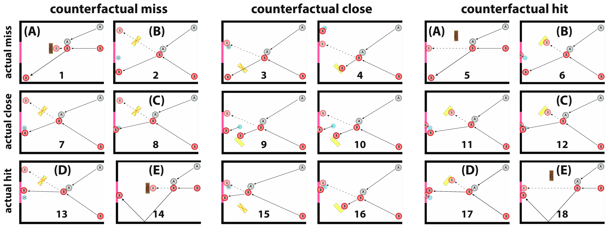
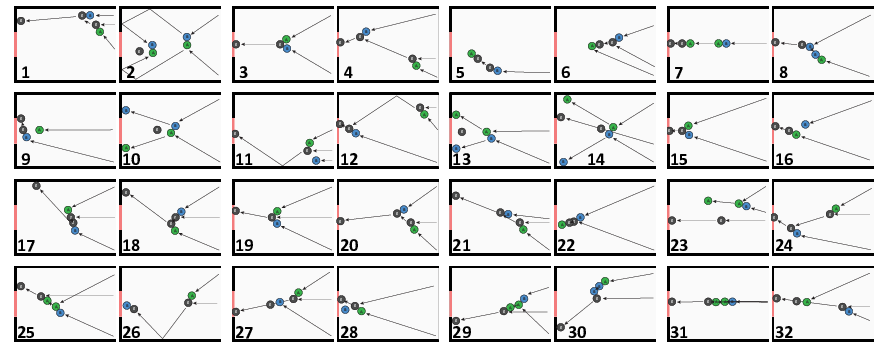

# Setup

```{r setup, include=FALSE}
knitr::opts_chunk$set(
  comment = "",
  fig.show = "hold")
```

## Load packages 

```{r, message=F}
library("knitr")     # for knitting stuff
library("lme4")      # for linear mixed effects models
library("broom")     # for tidying model results 
library("brms")      # Bayesian regression with Stan
library("corrr")     # for tidy correlation matrix
library("xtable")    # for latex tables
library("jsonlite")  # for reading json files
library("janitor")   # cleans stuff
library("Hmisc")     # bootstrapped confidence intervals
library("tidybayes") # for Bayesian data analysis
library("png")       # adding pngs to images
library("grid")      # functions for dealing with images 
library("egg")       # for geom_custom
library("patchwork") # for figure panels
library("tidyverse") # for wrangling, plotting, etc. 
```

## Helper functions 

```{r}
# root mean squared error
rmse = function(x, y){
  return(sqrt(mean((x - y)^2)))
}

actual_counterfactual_plot = function(x, ylabel) {
  p = ggplot(data = x, 
              mapping = aes(x = clipindex,
                            y = value,
                            fill = colorindex,
                            group = model)) +
    stat_summary(geom = "bar",
                 fun = "mean",
                 color = "black",
                 position = position_dodge(0.7),
                 width = 0.7) +
    stat_summary(geom = "linerange",
                 fun.data = "mean_cl_boot",
                 position = position_dodge(0.7),
                 size = 1) +
    geom_point(data = x %>% mutate(value = ifelse(model == "rating", value, NA)),
               position = position_jitterdodge(dodge.width = 0.7, jitter.width = 0.2),
               shape = 21,
               color = "black",
               size = 1,
               alpha = 0.2) +
    scale_fill_manual(values = c("red2", "green2", "black")) +
    facet_grid(index_actual ~ index_counterfactual) +
    geom_text(data = df.text %>%
                drop_na(label),
              mapping = aes(x = x, y = y, label = as.character(label)),
              size = 6,
              position = position_dodge(width = .7),
              hjust = 0.5) +
    coord_cartesian(xlim = c(0.5, 2.5),
                    ylim = c(-5, 105),
                    expand = F,
                    clip = "off") +
    labs(y = ylabel) +
    theme(text = element_text(size = 20),
          legend.position = "none",
          axis.text.x = element_blank(),
          axis.ticks.x = element_blank(),
          axis.title.y = element_text(margin = margin(0, 10, 0, 0)),
          panel.spacing.y = unit(0.8, "cm"),
          plot.margin = unit(c(0.2, 0.2, .8, .2), "cm"),
          axis.title.x = element_blank(),
          panel.grid = element_blank(),
          strip.background = element_blank(),
          panel.border = element_rect(colour = "black", fill = NA))
  print(p)
}

actual_counterfactual_threeballs_plot = function(x, ylabel) {
  p = ggplot(data = x, 
              mapping = aes(x = ball,
                            y = value,
                            group = model,
                            fill = colorindex)) +
    stat_summary(fun = "mean",
                 geom = "bar",
                 color = "black",
                 position = position_dodge(0.9),
                 width = 0.9) +
    stat_summary(fun.data = "mean_cl_boot",
                 geom = "linerange",
                 color = "black",
                 position = position_dodge(0.9)) +
    geom_point(data = x %>% 
                 mutate(value = ifelse(model == "rating", value, NA)),
               position = position_jitterdodge(jitter.width = 0.3,
                                               jitter.height = 0,
                                               dodge.width = 0.9),
               shape = 21,
               color = "black",
               size = 1,
               alpha = 0.15) +
    facet_wrap(~clip, ncol = 8) +
    geom_text(data = df.text, 
              mapping = aes(x = x,
                            y = y,
                            label = as.character(label)),
              size = 5, 
              position = position_dodge(width = .9), 
              hjust = 0.5, 
              fontface = "bold") +
    coord_cartesian(xlim = c(0.5, 2.5), 
                    ylim = c(-5, 120), 
                    expand = F,
                    clip = "off") +
    scale_y_continuous(breaks = seq(0, 100, 25)) +
    scale_fill_manual(values = c("red2", "green2", "black")) +
    scale_color_manual(values = c("red2", "green2", "black")) +
    labs(y = ylabel) +
    theme(text = element_text(size = 16),
          legend.position = "none",
          axis.title.x = element_blank(),
          panel.spacing.y = unit(c(.3), "cm"),
          panel.grid = element_blank(),
          strip.background = element_blank(),
          strip.text = element_blank(),
          panel.border = element_rect(colour = "black", fill = NA))
  print(p)
}

```

```{r}
# set ggplot theme 
theme_set(theme_classic())
```

# Experiment 1: 2 balls

## Clips 

```{r exp1-diagrams, out.width="100%"}

```

## Read in data 

```{r}
# causal judgments
df.exp1.causal = read.csv("../../data/experiment1_causal.csv", 
                          header = T,
                          stringsAsFactors = F)

# counterfactual judgments
df.exp1.counterfactual = read.csv("../../data/experiment1_counterfactual.csv",
                                  header = T,
                                  stringsAsFactors = F)

# Information about each clip 
df.exp1.clipinfo = tibble(clip = 1:18,
                          outcome_actual = c(0, 0, 0, 0, 0, 0, 0, 1, 0, 
                                             1, 1, 0, 1, 1, 1, 1, 1, 1),
                          outcome_counterfactual = c(0, 0, 0, 1, 1, 1, 0, 0, 1, 
                                                     0, 1, 1, 0, 0, 1, 0, 1, 1),
                          index_actual = rep(c("actual miss", 
                                               "actual close", 
                                               "actual hit"), each = 6),
                          index_counterfactual = rep(rep(c("counterfactual miss",
                                                           "counterfactual close", 
                                                           "counterfactual hit"),
                                                         each = 2),
                                                     3)) %>% 
  mutate(index_actual = factor(index_actual, levels = c("actual miss", 
                                                        "actual close", 
                                                        "actual hit")),
         index_counterfactual = factor(index_counterfactual, 
                                       levels = c("counterfactual miss",
                                                  "counterfactual close", 
                                                  "counterfactual hit")))

# Structure data 
df.exp1.causal.long = df.exp1.causal$data %>%
  as_tibble() %>% 
  mutate(participant = 1:n()) %>% 
  separate_rows(value, sep = ",") %>% 
  mutate(name = rep(c("clip", "rating"), n()/2),
         order = rep(rep(1:18, each = 2), max(participant)),
         value = as.numeric(value)) %>% 
  pivot_wider(names_from = name,
              values_from = value) %>% 
  arrange(participant, clip, rating) %>% 
  left_join(df.exp1.clipinfo,
            by = "clip")

df.exp1.counterfactual.long = df.exp1.counterfactual$data %>%
  as_tibble() %>% 
  mutate(participant = 1:n()) %>% 
  separate_rows(value, sep = ",") %>% 
  mutate(name = rep(c("clip", "rating"), n()/2),
         order = rep(rep(1:18, each = 2), max(participant)),
         value = as.numeric(value)) %>% 
  pivot_wider(names_from = name,
              values_from = value) %>% 
  arrange(participant, clip, rating) %>% 
  left_join(df.exp1.clipinfo,
            by = "clip")
```

### Demographics 

```{r}
# counterfactual condition 
df.exp1.counterfactual %>% 
  separate(extra,
           into = c("gender", "age", "difficulty", "smoothness", "time"),
           sep = ",") %>% 
  mutate(gender = factor(gender, levels = c(1, 2), labels = c("female", "male"))) %>% 
  select(gender:time) %>% 
  mutate_if(is.character, ~ as.numeric(.)) %>% 
  summarize(n = nrow(.),
            age_mean = mean(age) %>% round(0),
            age_sd = sd(age) %>% round(1),
            n_female = sum(gender == "female"),
            time_mean = mean(time) %>% round(2),
            time_sd = sd(time) %>% round(2))

# causal condition 
df.exp1.causal %>% 
  separate(extra,
           into = c("gender", "age", "difficulty", "smoothness", "time"),
           sep = ",") %>% 
  mutate(gender = factor(gender, levels = c(1, 2), labels = c("female", "male"))) %>% 
  select(gender:time) %>% 
  mutate_if(is.character, ~ as.numeric(.)) %>% 
  summarize(n = nrow(.),
            age_mean = mean(age) %>% round(0),
            age_sd = sd(age) %>% round(1),
            n_female = sum(gender == "female"),
            time_mean = mean(time) %>% round(2),
            time_sd = sd(time) %>% round(2))
```

## Read in model predictions 

### Counterfactual condition

```{r}
# read model predictions 
path = "../python/results/"
files = list.files(path = path, pattern = "*.csv")
files = files[str_detect(files, "2ball")]

df.exp1.model = files %>%
  map(~ read.csv(str_c(path, .))) %>%
  reduce(rbind) %>%
  set_names(c("clip", "noise", "prediction")) %>%
  left_join(df.exp1.clipinfo, by = "clip") %>%
  mutate(prediction = ifelse(outcome_actual == 1, 1 - prediction, prediction))

# calculate mean counterfactual judgments 
df.exp1.counterfactual.means = df.exp1.counterfactual.long %>%
  group_by(clip) %>%
  summarize(rating_mean = mean(rating),
            rating_low = smean.cl.boot(rating)[2],
            rating_high = smean.cl.boot(rating)[3]) %>%
  ungroup() %>%
  left_join(df.exp1.clipinfo, by = "clip")

# find noisy simulation model that best predicts the mean counterfactual judgments by 
# minimizing the sum of squared errors 
df.exp1.counterfactual.model = df.exp1.model %>% 
  group_by(noise) %>% 
  nest() %>% 
  mutate(sse = map(data, ~ sum((.x$prediction*100 - df.exp1.counterfactual.means$rating_mean) ^ 2)),
         sse = unlist(sse)) %>% 
  ungroup() %>% 
  filter(sse == min(sse)) %>% 
  unnest(data) %>% 
  mutate(prediction = prediction * 100)
```

### Causal condition 

```{r}
df.exp1.causal.model = df.exp1.counterfactual.long %>% 
  group_by(clip) %>% 
  summarize(empirical = mean(rating)) %>% 
  ungroup() %>% 
  left_join(df.exp1.counterfactual.model %>% 
              select(-c(noise, sse)),
            by = "clip") %>% 
  rename(simulation = prediction) %>% 
  mutate(empirical = ifelse(outcome_actual == 1, 100 - empirical, empirical),
         simulation = ifelse(outcome_actual == 1, 100 - simulation, simulation))
```

## Counterfactual condition 

### Plots

```{r}
set.seed(1)
df.plot = df.exp1.counterfactual.long %>% 
  mutate(rating = abs(rating),
         clipindex = rep(c(1, 2), nrow(.)/2)) %>% 
  left_join(df.exp1.counterfactual.model,
            by = c("clip",
                   "outcome_actual",
                   "outcome_counterfactual",
                   "index_actual",
                   "index_counterfactual")) %>% 
  pivot_longer(cols = c(rating, prediction),
               names_to = "model",
               values_to = "value") %>% 
  mutate(colorindex = ifelse(outcome_counterfactual == 1, 2, 1),
         colorindex = ifelse(model != "rating", 3, colorindex),
         colorindex = as.factor(colorindex),
         index_actual = factor(index_actual,
                               levels = c("actual miss", "actual close", "actual hit")),
         index_counterfactual = factor(index_counterfactual,
                                       levels = c("counterfactual miss",
                                                  "counterfactual close",
                                                  "counterfactual hit")),
         model = factor(model, levels = c("rating", "prediction"))) %>% 
  mutate(clipindex = ifelse(clip == 11, 2, clipindex),
         clipindex = ifelse(clip == 12, 1, clipindex)) #swap clips 11 and 12


df.text = df.plot %>%
  expand(index_actual, index_counterfactual, clipindex, model) %>%
  mutate(label = rep(1:18, each = 2),
         label = ifelse(model != "rating", NA, label),
         y = -15,
         x = clipindex,
         colorindex = NA)

actual_counterfactual_plot(x = df.plot, ylabel = "counterfactual judgment")
ggsave("../../figures/plots/exp1_counterfactual_bars.pdf",
       width = 8,
       height = 6)
```

### Stats

#### Model evaluation

```{r}
df.exp1.counterfactual.means %>% 
  left_join(df.exp1.counterfactual.model,
            by = c("clip",
                   "outcome_actual",
                   "outcome_counterfactual",
                   "index_actual",
                   "index_counterfactual")) %>% 
  summarize(noise = unique(noise), 
            simulation_r = cor(rating_mean, prediction),
            simulation_rmse = rmse(rating_mean, prediction)) %>% 
  mutate_all(~ round(., 2))
```

## Causal condition 

### Plots 

```{r}
set.seed(1)

model.name = c("empirical")
# model.name = c("simulation")

df.plot = df.exp1.causal.long %>%
  mutate(rating = abs(rating),
         clipindex = rep(c(1, 2), nrow(.) / 2)) %>%
  left_join(df.exp1.causal.model,
            by = c("clip",
                   "outcome_actual",
                   "outcome_counterfactual",
                   "index_actual",
                   "index_counterfactual")) %>%
  pivot_longer(cols = c(rating, simulation, empirical),
               names_to = "model",
               values_to = "value") %>% 
  filter(model %in% c(model.name, "rating")) %>%
  mutate(model = factor(model, levels = c("rating", model.name))) %>%
  mutate(
    colorindex = ifelse(outcome_actual == 1, 2, 1),
    colorindex = ifelse(model != "rating", 3, colorindex),
    colorindex = as.factor(colorindex),
    index.actual = factor(index_actual, 
                          levels = c("actual miss", "actual close", "actual hit")),
    index.counterfactual = factor(index_counterfactual, 
                                  levels = c("counterfactual miss", 
                                             "counterfactual close", 
                                             "counterfactual hit"))) %>%
  mutate(clipindex = ifelse(clip == 11, 2, clipindex),
         clipindex = ifelse(clip == 12, 1, clipindex)) # swap clips 11 and 12

df.text = df.plot %>%
  expand(index_actual, index_counterfactual, clipindex, model) %>%
  mutate(label = rep(1:18, each = 2),
         label = ifelse(model != "rating", NA, label),
         y = -15,
         x = clipindex,
         colorindex = NA)

actual_counterfactual_plot(df.plot, "causal judgment")

ggsave("../../figures/plots/exp1_causal_bars.pdf",
       width = 8,
       height = 6)
```

### Stats

#### Model evaluation 

```{r}
df.exp1.causal.long %>% 
  mutate(rating = abs(rating)) %>% 
  group_by(clip,
           outcome_actual, 
           outcome_counterfactual,
           index_actual,
           index_counterfactual) %>% 
  summarize(rating = mean(rating)) %>% 
  ungroup() %>% 
  left_join(df.exp1.causal.model,
            by = c("clip", 
                   "outcome_actual", 
                   "outcome_counterfactual", 
                   "index_actual", 
                   "index_counterfactual")) %>% 
  summarize(empirical_r = cor(rating, empirical),
            empirical_rmse = rmse(rating, empirical),
            simulation_r = cor(rating, simulation),
            simulation_rmse = rmse(rating, simulation)) %>% 
  mutate_all(~ round(., 2))
```

#### Bayesian regression

```{r}
# random intercepts model 
fit.brm_exp1_causal = brm(formula = rating ~ 1 + index_actual + index_counterfactual + 
                            outcome_actual + (1 + index_actual + index_counterfactual + 
                                                outcome_actual | participant),
                          data = df.exp1.causal.long,
                          cores = 2,
                          seed = 1,
                          file = "cache/brm_exp1_causal")
```

#### Specific hypotheses 

```{r}
df.exp1.causal.posterior = df.exp1.causal.long %>% 
  group_by(clip, index_actual, index_counterfactual, outcome_actual) %>% 
  summarize(value = mean(rating)) %>% 
  ungroup() %>% 
  add_fitted_draws(newdata = .,
                   model = fit.brm_exp1_causal,
                   re_formula = NA) %>% 
  ungroup() %>% 
  select(clip, .value, .draw) %>% 
  pivot_wider(names_from = clip,
              values_from = .value)

func_posterior_difference = function(data, clip1, clip2){
  data %>% 
    mutate(difference = .data[[clip1]] - .data[[clip2]]) %>% 
    pull(difference) %>% 
    mean_hdci() %>% 
    mutate_if(is.numeric, ~round(., 2)) %>% 
    summarize(difference = str_c("(", y, " [", ymin, ", ", ymax, "])")) %>% 
    print()  
}

func_posterior_difference(data = df.exp1.causal.posterior,
                          clip1 = "8",
                          clip2 = "13")

```


### Tables

```{r}
fit.brm_exp1_causal %>% 
  tidy() %>% 
  filter(str_detect(term, "b_")) %>% 
  mutate(term = str_remove(term, "b_"),
         term = tolower(term)) %>% 
  mutate_if(is.numeric, ~ round(., 2)) %>% 
  rename(`lower 95% HDI` = lower,
         `upper 95% HDI` = upper) %>% 
  xtable() %>%
  print(include.rownames = F,
        booktabs = T)
```


# Experiment 2: Brick & Teleport 

## Clips 

```{r exp2-diagrams, out.width="100%"}
include_graphics("../../figures/diagrams/exp2_diagrams.png")
```

## Read in data 

```{r}
df.exp2.causal_first = read.csv("../../data/experiment2_causal_first.csv",
                                header = T,
                                stringsAsFactors = F)
df.exp2.counterfactual_first = read.csv("../../data/experiment2_counterfactual_first.csv",
                                        header = T,
                                        stringsAsFactors = F)

# Information about each clip

df.exp2.clipinfo = tibble(clip = 1:20,
                          outcome_actual = c(0, 0, 0, 0, 0, 0, 0, 1, 0, 1, 
                                             0, 1, 1, 1, 1, 1, 1, 1, 0, 1),
                          outcome_counterfactual = c(0, 0, 1, 0, 1, 1, 0, 0, 1, 0, 
                                                     1, 1, 0, 0, 1, 0, 1, 1, 1, 1),
                          index_actual = c(rep(c("actual miss", "actual close", "actual hit"),
                                               each = 6),
                                           rep("practice", 2)),
                          index_counterfactual = c(rep(rep(c("counterfactual miss",
                                                             "counterfactual close",
                                                             "counterfactual hit"),
                                                           each = 2), 
                                                       3),
                                                   rep("practice", 2))) %>% 
  mutate(index_actual = factor(index_actual, levels = c("actual miss", 
                                                        "actual close", 
                                                        "actual hit")),
         index_counterfactual = factor(index_counterfactual, 
                                       levels = c("counterfactual miss",
                                                  "counterfactual close", 
                                                  "counterfactual hit")))

# Structure data 
df.exp2.causal_first.long = df.exp2.causal_first$data %>% 
  as_tibble() %>% 
  mutate(participant = 1:n()) %>% 
  separate_rows(value, sep = ",") %>% 
  mutate(name = rep(c("clip", "rating"), n()/2),
         order = rep(rep(1:40, each = 2), max(participant)),
         value = as.numeric(value)) %>% 
  pivot_wider(names_from = name,
              values_from = value) %>% 
  mutate(question = rep(rep(c("causal", "counterfactual"), each = 20), max(participant)),
         condition = "causal_first") %>% 
  left_join(df.exp2.clipinfo,
            by = "clip") %>%
  arrange(participant, question, clip) %>%
  select(participant, question, clip, rating, everything())

df.exp2.counterfactual_first.long = df.exp2.counterfactual_first$data %>% 
  as_tibble() %>% 
  mutate(participant = 1:n()) %>% 
  separate_rows(value, sep = ",") %>% 
  mutate(name = rep(c("clip", "rating"), n()/2),
         order = rep(rep(1:40, each = 2), max(participant)),
         value = as.numeric(value)) %>% 
  pivot_wider(names_from = name,
              values_from = value) %>% 
  mutate(question = rep(rep(c("counterfactual", "causal"), each = 20), max(participant)),
         condition = "counterfactual_first") %>% 
  left_join(df.exp2.clipinfo,
            by = "clip") %>%
  arrange(participant, question, clip) %>%
  select(participant, question, clip, rating, everything())

# combine data from both conditions
df.exp2.combined.long = df.exp2.causal_first.long %>%
  bind_rows(df.exp2.counterfactual_first.long %>% 
              mutate(participant = participant + 
                       max(df.exp2.causal_first.long$participant)))
```


### Demographics 

```{r}
# counterfactual condition 
df.exp2.counterfactual_first %>% 
  separate(extra,
           into = c("gender", "age", "difficulty", "smoothness", "time", "condition"),
           sep = ",") %>% 
  select(gender:time) %>% 
  bind_rows(df.exp2.causal_first %>% 
  separate(extra,
           into = c("gender", "age", "difficulty", "smoothness", "time", "condition"),
           sep = ",") %>% 
  select(gender:time)) %>% 
  mutate(gender = factor(gender, levels = c(1, 2), labels = c("female", "male"))) %>% 
  mutate_if(is.character, ~ as.numeric(.)) %>% 
  summarize(n = nrow(.),
            age_mean = mean(age) %>% round(0),
            age_sd = sd(age) %>% round(1),
            n_female = sum(gender == "female"),
            time_mean = mean(time) %>% round(2),
            time_sd = sd(time) %>% round(2))
```

## Read in model predictions 

### Counterfactual condition 

```{r}
# read model predictions 
path = "../python/results/"
files = list.files(path = path, pattern = "*.csv")
files = files[str_detect(files, "teleport")]

df.exp2.model = files %>%
  map(~ read.csv(str_c(path, .))) %>% 
  reduce(rbind) %>%
  set_names(c("clip", "noise", "prediction")) %>%
  left_join(df.exp2.clipinfo, by = "clip") %>%
  mutate(prediction = ifelse(outcome_actual == 1, 1 - prediction, prediction))

# calculate mean counterfactual judgments 
df.exp2.counterfactual.means = df.exp2.combined.long %>%
  filter(question == "counterfactual",
         clip <= 18) %>%
  # mutate(rating = abs(rating)) %>% 
  group_by(clip) %>%
  summarize(rating = mean(rating)) %>%
  ungroup() %>%
  left_join(df.exp2.clipinfo, by = "clip")

# find noisy simulation model that best predicts the mean counterfactual judgments by 
# minimizing the sum of squared errors 
df.exp2.counterfactual.model = df.exp2.model %>% 
  group_by(noise) %>% 
  nest() %>% 
  mutate(sse = map(data, ~ sum((.x$prediction*100 - df.exp2.counterfactual.means$rating) ^ 2)),
         sse = unlist(sse)) %>% 
  ungroup() %>% 
  filter(sse == min(sse)) %>% 
  unnest(data) %>% 
  mutate(prediction = prediction * 100)

```

### Causal condition 

```{r}
# Model predictions based on counterfactual judgments
df.exp2.causal.model = df.exp2.combined.long %>%
  filter(question == "counterfactual",
    clip <= 18) %>%
  group_by(clip, condition) %>%
  summarize(rating = mean(rating)) %>%
  pivot_wider(names_from = condition,
              values_from = rating) %>% 
  left_join(df.exp2.combined.long %>%
              filter(question == "counterfactual", clip <= 18) %>%
              group_by(clip) %>%
              summarize(combined = mean(rating)),
            by = "clip") %>% 
  left_join(df.exp2.counterfactual.model,
            by = "clip") %>% 
  select(-c(sse, noise)) %>% 
  rename(simulation = prediction) %>% 
  mutate_at(.vars = vars(simulation, causal_first, counterfactual_first, combined),
            .funs = list(~ ifelse(outcome_actual == 1, 100 - ., .)))

```

## Counterfactual condition 

### Plots

```{r fig.height=6, fig.width=8, warning=FALSE}
set.seed(1)

df.plot = df.exp2.combined.long %>%
  filter(question == "counterfactual",
         clip <= 18) %>%
  mutate(clipindex = rep(c(1, 2), nrow(.) / 2)) %>%
  left_join(df.exp2.counterfactual.model,
            by = c("clip", 
                   "outcome_actual", 
                   "outcome_counterfactual", 
                   "index_actual", 
                   "index_counterfactual")) %>%
  pivot_longer(cols = c(rating, prediction),
               names_to = "model",
               values_to = "value") %>% 
  mutate(colorindex = ifelse(outcome_counterfactual == 1, 2, 1),
         colorindex = ifelse(model != "rating", 3, colorindex),
         colorindex = as.factor(colorindex),
         index_actual = factor(index_actual,
                               levels = c("actual miss", 
                                          "actual close", 
                                          "actual hit")),
         index_counterfactual = factor(index_counterfactual, 
                                       levels = c("counterfactual miss", 
                                                  "counterfactual close", 
                                                  "counterfactual hit")),
         model = factor(model,
                             levels = c("rating", "prediction")))

df.text = df.plot %>%
  expand(index_actual, index_counterfactual, clipindex, model) %>%
  mutate(label = rep(c("1 (A)", "2 (B)", "3", "4", "5 (A)", "6 (B)",
                       "7", "8 (C)", "9", "10", "11", "12 (C)",
                       "13 (D)", "14 (E)", "15", "16", "17 (D)", "18 (E)"), each = 2),
         label = ifelse(model != "rating", NA, label),
         y = -15,
         x = clipindex,
         colorindex = NA)

actual_counterfactual_plot(df.plot, "counterfactual judgment")

# ggsave("../../figures/plots/exp2_counterfactual_bars.pdf",
#        width = 8,
#        height = 6)
```

### Stats

#### Model evaluation

```{r}
df.exp2.counterfactual.means %>% 
  left_join(df.exp2.counterfactual.model,
            by = c("clip",
                   "outcome_actual",
                   "outcome_counterfactual",
                   "index_actual",
                   "index_counterfactual")) %>% 
  summarize(noise = unique(noise),
            simulation_r = cor(rating, prediction),
            simulation_rmse = rmse(rating, prediction)) %>% 
  mutate_all(~ round(., 2))
```

#### Bayesian regressions

##### Check for potential order effects

```{r}
# random intercepts & slopes model 
fit.brm_exp2_counterfactual = brm(formula = rating ~ 1 + condition * 
                                    (index_actual + index_counterfactual) + 
                                    (1 + index_actual + index_counterfactual | participant),
                                  data = df.exp2.combined.long %>% 
                                    na.omit() %>% 
                                    filter(question == "counterfactual"),
                                  cores = 2,
                                  seed = 1,
                                  file = "cache/brm_exp2_counterfactual")
```

### Tables

```{r}
fit.brm_exp2_counterfactual %>% 
  tidy() %>% 
  filter(str_detect(term, "b_")) %>% 
  mutate(term = str_remove(term, "b_"),
         term = tolower(term)) %>% 
  mutate_if(is.numeric, ~ round(., 2)) %>% 
  rename(`lower 95% HDI` = lower,
         `upper 95% HDI` = upper) %>% 
  xtable() %>%
  print(include.rownames = F,
        booktabs = T)
```


## Causal condition 

### Plots 

```{r}
set.seed(1)

# which causal condition? 
# condition.name = c("causal_first")
condition.name = c("counterfactual_first")
# condition.name = c("causal_first", "counterfactual_first")

# which model for the counterfactual simulations 
# model.name = c("simulation")
# model.name = c("causal_first")
# model.name = c("counterfactual_first")
model.name = c("combined")

df.plot = df.exp2.combined.long %>%
  filter(question == "causal", clip <= 18) %>%
  filter(condition %in% condition.name) %>%
  mutate(rating = abs(rating),
         clipindex = rep(c(1, 2), nrow(.) / 2)) %>%
  left_join(df.exp2.causal.model,
            by = c("clip", 
                   "outcome_actual", 
                   "outcome_counterfactual", 
                   "index_actual", 
                   "index_counterfactual")) %>%
  pivot_longer(cols = c("rating", model.name),
               names_to = "model",
               values_to = "value") %>% 
  mutate(model = factor(model, levels = c("rating", model.name))) %>%
  mutate(colorindex = ifelse(outcome_actual == 1, 2, 1),
         colorindex = ifelse(model != "rating", 3, colorindex),
         colorindex = as.factor(colorindex),
         index_actual = factor(index_actual, 
                               levels = c("actual miss", 
                                          "actual close", 
                                          "actual hit")),
         index_counterfactual = factor(index_counterfactual, 
                                       levels = c("counterfactual miss", 
                                                  "counterfactual close", 
                                                  "counterfactual hit")))

df.text = df.plot %>%
  expand(index_actual, index_counterfactual, clipindex, model) %>%
  mutate(label = rep(c("1 (A)", "2 (B)", "3", "4", "5 (A)", "6 (B)",
                       "7", "8 (C)", "9", "10", "11", "12 (C)",
                       "13 (D)", "14 (E)", "15", "16", "17 (D)", "18 (E)"), each = 2),
         label = ifelse(model != "rating", NA, label),
         y = -15,
         x = clipindex,
         colorindex = NA)

actual_counterfactual_plot(df.plot, "causal judgment")

# ggsave(str_c("../../figures/plots/exp2_", condition.name ,"_causal_bars.pdf"),
#        width = 8,
#        height = 6)
```

### Stats 

#### Model evaluation

```{r}
df.exp2.combined.long %>% 
  filter(question == "causal",
         clip <= 18) %>% 
  mutate(rating = abs(rating)) %>% 
  group_by(clip,
           outcome_actual, 
           outcome_counterfactual,
           index_actual,
           index_counterfactual) %>% 
  summarize(rating = mean(rating)) %>% 
  ungroup() %>% 
  left_join(df.exp2.causal.model,
            by = c("clip", 
                   "outcome_actual", 
                   "outcome_counterfactual", 
                   "index_actual", 
                   "index_counterfactual")) %>% 
  summarize(empirical_r = cor(rating, combined),
            empirical_rmse = rmse(rating, combined),
            simulation_r = cor(rating, simulation),
            simulation_rmse = rmse(rating, simulation)) %>% 
  mutate_all(~ round(., 2))
```

#### Bayesian regression

```{r}
# random intercepts + slopes model 
fit.brm_exp2_causal = brm(formula = rating ~ 1 + condition * 
                            (index_actual + index_counterfactual + outcome_actual) +
                            (1 + index_actual + index_counterfactual + 
                               outcome_actual | participant),
                          data = df.exp2.combined.long %>% 
                            filter(question == "causal",
                                   clip <= 18),
                          cores = 2,
                          seed = 1,
                          file = "cache/brm_exp2_causal")
```

#### Specific hypotheses 

```{r}
df.exp2.causal.posterior = df.exp2.combined.long %>% 
  filter(question == "causal",
         clip <= 18) %>% 
  group_by(clip, index_actual, index_counterfactual, outcome_actual, condition) %>% 
  summarize(value = mean(rating)) %>% 
  ungroup() %>% 
  add_fitted_draws(newdata = .,
                   model = fit.brm_exp2_causal,
                   re_formula = NA) %>% 
  ungroup() %>% 
  select(clip, condition, .value, .draw) %>% 
  pivot_wider(names_from = clip,
              values_from = .value)

# difference between clips 13 and 14 versus 8 
df.exp2.causal.posterior %>% 
    mutate(difference = (`13`  + `14`) / 2 - `8`) %>% 
    pull(difference) %>% 
    mean_hdi() %>% 
    mutate_if(is.numeric, ~round(., 2)) %>% 
    summarize(difference = str_c("(", y, " [", ymin, ", ", ymax, "])"))

# difference between clips 5 and 6 versus 11 
df.exp2.causal.posterior %>% 
    mutate(difference = (`5`  + `6`) / 2 - `11`) %>% 
    pull(difference) %>% 
    mean_hdi() %>% 
    mutate_if(is.numeric, ~round(., 2)) %>% 
    summarize(difference = str_c("(", y, " [", ymin, ", ", ymax, "])"))

```

### Tables 

#### Bayesian regression

```{r}
fit.brm_exp2_causal %>% 
  tidy() %>% 
  filter(str_detect(term, "b_")) %>% 
  mutate(term = str_remove(term, "b_"),
         term = tolower(term)) %>% 
  mutate_if(is.numeric, ~ round(., 2)) %>% 
  rename(`lower 95% HDI` = lower,
         `upper 95% HDI` = upper) %>% 
  xtable() %>%
  print(include.rownames = F,
        booktabs = T)
```

# Experiment 3: 3 balls

## Clips 

```{r exp3-diagrams, out.width="100%"}

```

## Read in data 

```{r}
# clipinfo
df.exp3.clipinfo = tibble(clip = 1:32,
                          outcome_both = c(0, 0, 1, 1, 0, 0, 1, 1, 0, 0, 1, 1, 0, 0, 1, 1, 
                                           0, 0, 1, 1, 0, 0, 1, 1, 0, 0, 1, 1, 0, 0, 1, 1),
                          outcome_a = c(0, 0, 0, 0, 0, 0, 0, 0, 1, 1, 1, 1, 1, 1, 1, 1, 
                                        0, 0, 0, 0, 0, 0, 0, 0, 1, 1, 1, 1, 1, 1, 1, 1),
                          outcome_b = c(0, 0, 0, 0, 1, 1, 1, 1, 0, 0, 0, 0, 1, 1, 1, 1, 
                                        0, 0, 0, 0, 1, 1, 1, 1, 0, 0, 0, 0, 1, 1, 1, 1),
                          outcome_none = c(0, 0, 0, 0, 0, 0, 0, 0, 0, 0, 0, 0, 0, 0, 0, 0, 
                                           1, 1, 1, 1, 1, 1, 1, 1, 1, 1, 1, 1, 1, 1, 1, 1),
                          clipindex = rep(1:2, 16))

# COUNTERFACTUAL JUDGMENTS 
df.exp3.counterfactual = read.csv("../../data/experiment3_counterfactual.csv",
                                  header = T,
                                  stringsAsFactors = F)

# demographics
df.exp3.counterfactual.demographics = df.exp3.counterfactual$extra %>% 
  as_tibble() %>% 
  separate_rows(value) %>% 
  mutate(value = as.numeric(value),
         name = rep(c("gender", "age", "difficulty", "smoothness", "time", "condition"),
                    n()/6),
         participant = rep(1:(n()/6), each = 6)) %>% 
  pivot_wider(names_from = name,
              values_from = value) %>% 
  mutate(condition = factor(condition, levels = 20:21, labels = c("A", "B")),
         gender = factor(gender, levels = 1:2, labels = c("female", "male"))) %>% 
  select(participant, condition, gender, age, time, smoothness, difficulty)

# judgments
df.exp3.counterfactual.long = df.exp3.counterfactual$data %>%
  as_tibble() %>% 
  separate_rows(value) %>% 
  mutate(value = as.numeric(value),
         name = rep(c("clip", "rating"), n()/2),
         participant = rep(1:(n()/64), each = 64),
         order = rep(rep(1:32, each = 2), n()/64)) %>% 
  pivot_wider(names_from = name,
              values_from = value) %>% 
  left_join(df.exp3.counterfactual.demographics %>% 
              select(participant, ball = condition),
            by = "participant") %>% 
  select(participant, ball, clip, everything()) %>% 
  arrange(participant, clip)

# CAUSAL JUDGMENTS
df.exp3.causal = read.csv("../../data/experiment3_causal.csv",
                          header = T,
                          stringsAsFactors = F)

# demographics 
df.exp3.causal.demographics = df.exp3.causal$extra %>% 
  as_tibble() %>% 
  separate_rows(value) %>% 
  mutate(value = as.numeric(value),
         name = rep(c("gender", "age", "difficulty", "smoothness", "time", 
                      "counterbalance", "replayType", "experiment"),
                    n()/8),
         participant = rep(1:(n()/8), each = 8)) %>% 
  pivot_wider(names_from = name,
              values_from = value) %>% 
  mutate(counterbalance = ifelse(participant %in% c(1, 3, 5, 6, 9), 1, counterbalance),
         gender = factor(gender, levels = 1:2, labels = c("female", "male"))) %>% 
  select(participant, gender, age, counterbalance, time, smoothness, difficulty)

# judgments
df.exp3.causal.long = df.exp3.causal$data %>%
  as_tibble() %>% 
  separate_rows(value) %>% 
  mutate(value = as.numeric(value),
         name = rep(c("clip", "x", "y", "z", "rating1", "rating2"), n()/6),
         participant = rep(1:(n()/(32*6)), each = (32*6)),
         order = rep(rep(1:32, each = 6), n()/(32*6))) %>% 
  filter(!name %in% c("x", "y", "z")) %>% 
pivot_wider(names_from = name,
            values_from = value) %>% 
  left_join(df.exp3.causal.demographics %>% 
              select(participant, counterbalance),
            by = "participant") %>% 
  mutate(A = ifelse(counterbalance == 1, rating1, rating2),
         B = ifelse(counterbalance == 1, rating2, rating1)) %>% 
  select(-rating1, -rating2) %>% 
  pivot_longer(cols = c(A, B),
               names_to = "ball",
               values_to = "rating") %>% 
  select(participant, clip, ball, rating, order) %>% 
  arrange(participant, clip, ball)
```

### Demographics 

```{r}
# counterfactual condition 
df.exp3.counterfactual.demographics %>% 
  summarize(n = nrow(.),
            age_mean = mean(age) %>% round(0),
            age_sd = sd(age) %>% round(1),
            n_female = sum(gender == "female"),
            time_mean = mean(time) %>% round(2),
            time_sd = sd(time) %>% round(2))

# causal condition 
df.exp3.causal.demographics %>% 
  summarize(n = nrow(.),
            age_mean = mean(age) %>% round(0),
            age_sd = sd(age) %>% round(1),
            n_female = sum(gender == "female"),
            time_mean = mean(time) %>% round(2),
            time_sd = sd(time) %>% round(2))
```


## Read in model predictions 

```{r, message=F}
# read model predictions 
path = "../python/results/"
files = list.files(path = path, pattern = "*.csv")
files = files[str_detect(files, "3ball")]

df.exp3.model = files %>%
  map_dfr(~ read_csv(str_c(path, .))) %>% 
  rename(clip = trial)
```

### Counterfactual condition 

```{r}
# calculate mean counterfactual judgments 
df.exp3.counterfactual.means = df.exp3.counterfactual.long %>% 
  group_by(clip, ball) %>%
  summarize(rating_mean = mean(rating),
            rating_low = smean.cl.boot(rating)[2],
            rating_high = smean.cl.boot(rating)[3]) %>% 
  ungroup()

# find noisy simulation model that best predicts the mean counterfactual judgments by 
# minimizing the sum of squared errors 
df.exp3.model.counterfactual = df.exp3.model %>% 
  group_by(noise) %>% 
  select(clip, contains("whether"), noise) %>% 
  pivot_longer(cols = c(A_whether, B_whether),
               names_to = "ball",
               values_to = "prediction") %>% 
  mutate(ball = str_remove(ball, "_whether")) %>% 
  arrange(noise, clip, ball) %>% 
  left_join(df.exp3.clipinfo, by = "clip") %>% 
  mutate(prediction = ifelse(outcome_both == 1, 1 - prediction, prediction)) %>% 
  group_by(noise) %>% 
  nest() %>% 
  mutate(sse = map(data, ~ sum((.x$prediction*100 - df.exp3.counterfactual.means$rating_mean) ^ 2)),
         sse = unlist(sse)) %>% 
  ungroup() %>% 
  filter(sse == min(sse)) %>% 
  unnest(data) %>% 
  mutate(prediction = prediction * 100)
```

### Causal condition 

```{r}
# calculate mean causal judgments 
df.exp3.causal.means = df.exp3.causal.long %>% 
  group_by(clip, ball) %>%
  summarize(rating_mean = mean(rating),
            rating_low = smean.cl.boot(rating)[2],
            rating_high = smean.cl.boot(rating)[3]) %>% 
  ungroup()

df.exp3.model.causal = df.exp3.model %>% 
  # take into account difference-making 
  mutate_at(.vars = vars(A_how:A_robust),
            .funs = list(~ . * A_difference)) %>% 
  mutate_at(.vars = vars(B_how:B_robust),
            .funs = list(~ . * B_difference)) %>% 
  # choose model based on best fit with counterfactual data 
  filter(noise == unique(df.exp3.model.counterfactual$noise)) %>% 
  pivot_longer(cols = A_difference:B_robust,
               names_to = c("ball", "aspect"),
               names_sep = "_",
               values_to = "value") %>% 
  pivot_wider(names_from = aspect,
              values_from = value) %>% 
  select(clip, ball:robust)
```

### Heuristic model 

```{r, warning=F, message=F}
l.features = fromJSON("data/features.json")

df.features.initial = l.features[["appearance"]] %>%
  cbind(l.features[["initialVelocity"]][["ballA"]]) %>%
  cbind(l.features[["initialVelocity"]][["ballB"]]) %>%
  cbind(l.features[["initialVelocity"]][["ballE"]]) %>%
  setNames(c(str_c("ball", LETTERS[c(1, 2, 5)], "_appearance"),
             "ballA_velx",
             "ballA_vely",
             "ballB_velx",
             "ballB_vely",
             "ballE_velx",
             "ballE_vely")) %>%
  mutate(clip = 1:nrow(.)) %>%
  pivot_longer(cols = starts_with("ball")) %>%
  separate(name, into = c("ball", "property")) %>%
  pivot_wider(names_from = property, values_from = value) %>% 
  mutate(ball = str_remove_all(ball, pattern = "ball"))

# information about collisions
df.features.collisions = data.frame()
ballnames = c("ballA", "ballB", "ballE")

for (i in 1:32) {
  df.tmp = data.frame()
  for (j in 1:length(ballnames)) {
    ncollisions = length(l.features[["collisions"]][[ballnames[j]]][["object"]][[i]])
    if (ncollisions > 0) {
      tmp = data.frame(
        ball = ballnames[j],
        object = l.features[["collisions"]][[ballnames[j]]][["object"]][[i]],
        time = l.features[["collisions"]][[ballnames[j]]][["time"]][[i]],
        pre.velx = l.features[["collisions"]][[ballnames[j]]][["pre"]][[i]][["x"]],
        pre.vely = l.features[["collisions"]][[ballnames[j]]][["pre"]][[i]][["y"]],
        post.velx = l.features[["collisions"]][[ballnames[j]]][["post"]][[i]][["x"]],
        post.vely = l.features[["collisions"]][[ballnames[j]]][["post"]][[i]][["y"]],
        ncollision = 1:ncollisions
      )
      df.tmp = df.tmp %>%
        rbind(tmp)
    }
  }
  df.features.collisions = df.features.collisions %>%
    rbind(df.tmp %>%
            mutate(clip = i) %>%
            select(clip, ball, everything()))
}

# find end of clip
tmp = df.features.collisions %>%
  group_by(clip) %>%
  filter(ball == "ballE",
         str_detect(object, "goal|Left|Right")) %>%
  group_by(clip) %>%
  mutate(endclip = max(time)) %>%
  select(clip, endclip) %>%
  ungroup() %>%
  distinct()

# remove events that happen after the end of the clip
df.features.collisions = df.features.collisions %>%
  left_join(tmp, by = "clip") %>%
  mutate(endclip = ifelse(is.na(endclip), 400, endclip)) %>%
  group_by(clip) %>%
  filter(time <= endclip)

# E initially at rest or moving?
tmp.movingE = df.features.initial %>%
  filter(ball == "E") %>%
  mutate(E.moving = ifelse(velx == 0 & vely == 0, 1, 0)) %>%
  select(clip, E.moving)

# contact with ball E
tmp.contactE = df.features.collisions %>%
  filter(object == "ballE") %>%
  mutate(ball = factor(ball, levels = c("ballA", "ballB"), labels = c("A", "B"))) %>%
  mutate(contactE = 1) %>%
  select(clip, ball, contactE) %>%
  group_by(clip, ball) %>%
  summarize(contactE = any(contactE %>% as.logical()) * 1) %>%
  left_join(expand.grid(clip = 1:32, ball = c("A", "B")), .,
            by = c("clip", "ball")) %>%
  mutate(contactE = ifelse(is.na(contactE), 0, contactE))

# number of collisions
tmp.ncollisions = df.features.collisions %>%
  filter(str_detect(object, "ball"),
         ball != "ballE") %>%
  mutate(ball = factor(ball, levels = c("ballA", "ballB"), labels = c("A", "B"))) %>%
  group_by(clip, ball) %>%
  count() %>%
  rename(ncollision = n)

# exclusivity (no contact with ball E by the other ball)
tmp.exclusive = df.features.collisions %>%
  filter(str_detect(object, "ball"),
         ball != "ballE") %>%
  count(clip, ball, object) %>%
  mutate(AE = ifelse(ball == "ballA" & object == "ballE", 1, 0),
         BE = ifelse(ball == "ballB" & object == "ballE", 1, 0)) %>%
  group_by(clip) %>%
  summarize(AE = any(AE %>% as.logical()) * 1,
            BE = any(BE %>% as.logical()) * 1) %>%
  mutate(A = ifelse(AE == 1 & BE == 0, 1, 0),
         B = ifelse(AE == 0 & BE == 1, 1, 0)) %>%
  select(clip, A, B) %>%
  pivot_longer(cols = -clip,
               names_to = "ball",
               values_to = "exclusive")

# impact
func_angle = function(x, y) {
  dot.prod = x %*% y
  norm.x = norm(x, type = "2")
  norm.y = norm(y, type = "2")
  theta = acos(dot.prod / (norm.x * norm.y))
  as.numeric(theta)
}

# impact on ball E 
tmp.impactE = df.features.collisions %>%
  rowwise() %>%
  filter(str_detect(object, "ball"),
         ball == "ballE") %>%
  mutate(pre.speed = abs(pre.velx) + abs(pre.vely),
         post.speed = abs(post.velx) + abs(post.vely),
         speed.diff = post.speed - pre.speed,
         direction.diff = func_angle(c(pre.velx, pre.vely), c(post.velx, post.vely)),
         direction.diff = ifelse(is.na(direction.diff),
                                 abs(atan2(post.vely - pre.vely, post.velx - pre.velx)),
                                 direction.diff)) %>%
  ungroup() %>%
  group_by(clip, object) %>%
  summarize(speed.diff = sum(speed.diff),
            direction.diff = sum(direction.diff)) %>%
  rename(ball = object) %>%
  mutate(ball = factor(ball, levels = c("ballA", "ballB"), labels = c("A", "B"))) %>%
  left_join(expand.grid(clip = 1:32, ball = c("A", "B")), .,
            by = c("clip", "ball")) %>%
  mutate_at(.vars = vars(speed.diff, direction.diff), .funs = ~ ifelse(is.na(.), 0, .)) %>%
  arrange(clip, ball) %>%
  rename(E.speed.diff = speed.diff,
         E.direction.diff = direction.diff)

# total impact 
tmp.impactTotal = df.features.collisions %>%
  rowwise() %>%
  filter(str_detect(object, "ballA|ballB")) %>%
  mutate(pre.speed = abs(pre.velx) + abs(pre.vely),
         post.speed = abs(post.velx) + abs(post.vely),
         speed.diff = post.speed - pre.speed,
         direction.diff = func_angle(c(pre.velx, pre.vely), c(post.velx, post.vely)),
         direction.diff = ifelse(is.na(direction.diff),
                                 abs(atan2(post.vely - pre.vely, post.velx - pre.velx)),
                                 direction.diff)) %>%
  ungroup() %>%
  group_by(clip, object) %>%
  summarize(speed.diff = sum(speed.diff),
            direction.diff = sum(direction.diff)) %>%
  rename(ball = object) %>%
  mutate(ball = factor(ball, levels = c("ballA", "ballB"), labels = c("A", "B"))) %>%
  left_join(expand.grid(clip = 1:32, ball = c("A", "B")), .,
            by = c("clip", "ball")) %>%
  mutate_at(.vars = vars(speed.diff, direction.diff),
            .funs = ~ ifelse(is.na(.), 0, .)) %>%
  arrange(clip, ball) %>%
  rename(total.speed.diff = speed.diff,
         total.direction.diff = direction.diff)

# transfer of force 
tmp.transfer = df.features.collisions %>%
  filter(str_detect(ball, "ballA|ballB"),
         str_detect(object, "ball")) %>%
  mutate(AE = ifelse(ball == "ballA" & object == "ballE", 1, NA),
         BE = ifelse(ball == "ballB" & object == "ballE", 1, NA),
         AB = ifelse((ball == "ballA" & object == "ballB"), 1, NA)) %>%
  mutate_at(.vars = vars(AE, BE, AB), .funs = ~ . * time) %>%
  filter(!is.na(AE) | !is.na(BE) | !is.na(AB)) %>%
  arrange(clip, time) %>%
  group_by(clip) %>%
  summarize(A = any(!is.na(AE)),
            B = any(!is.na(BE)),
            A = ifelse(any(!is.na(AB)) & any(!is.na(BE)) & max(AB, na.rm = T) < min(BE, na.rm = T),
                       T,
                       A),
            B = ifelse(any(!is.na(AB)) & any(!is.na(AE)) & max(AB, na.rm = T) < min(AE, na.rm = T),
                       T,
                       B)) %>%
  pivot_longer(cols = -clip,
               names_to = "ball",
               values_to = "transfer") %>% 
  arrange(clip, ball)

# collect features
df.features = df.features.initial %>%
  filter(ball != "E") %>%
  mutate(ball = factor(ball)) %>%
  mutate(moving = ifelse(velx == 0 & vely == 0, 0, 1),
         speed = abs(velx) + abs(vely)) %>%
  left_join(tmp.contactE) %>%
  left_join(tmp.impactE) %>%
  left_join(tmp.impactTotal) %>%
  left_join(tmp.transfer %>% mutate(transfer = transfer * 1)) %>%
  left_join(tmp.movingE) %>%
  left_join(tmp.exclusive) %>%
  select(-c(appearance, velx, vely))

# remove temporary variables
rm(list = ls()[str_detect(ls(), "tmp")])
```

## Counterfactual condition 

### Plots

#### Bar graph

```{r fig.height=6, fig.width=12, warning=FALSE}
set.seed(1)

df.plot = df.exp3.counterfactual.long %>%
  left_join(df.exp3.model.counterfactual %>%
              select(clip, ball, prediction) %>%
              mutate(ball = as.factor(ball)),
            by = c("clip", "ball")) %>%
  left_join(df.exp3.clipinfo,
            by = "clip") %>% 
  pivot_longer(cols = c(rating, prediction),
               names_to = "model",
               values_to = "value") %>% 
  mutate(colorindex = 1,
         colorindex = ifelse(model == "rating" & ball == "A" & outcome_b == 1,
                             2,
                             colorindex),
         colorindex = ifelse(model == "rating" & ball == "B" & outcome_a == 1,
                             2,
                             colorindex),
         colorindex = ifelse(model == "prediction", 3, colorindex),
         colorindex = as.factor(colorindex),
         model = factor(model, levels = c("rating", "prediction"))) %>%
  arrange(participant, clip, ball)

df.text = df.plot %>%
  expand(ball, clip, model) %>%
  mutate(label = ifelse(model == "rating" & ball == "A", clip, NA),
         y = 110,
         x = 1.5,
         colorindex = NA)

actual_counterfactual_threeballs_plot(df.plot, "counterfactual judgment")
# ggsave("../../figures/plots/exp3_counterfactual_bars.pdf",
#        width = 12,
#        height = 6)
```

### Stats 

#### Model evaluation 

```{r}
# best fitting model 
df.exp3.counterfactual.means %>% 
  left_join(df.exp3.model.counterfactual,
            by = c("clip", "ball")) %>% 
  summarize(simulation_r = cor(rating_mean, prediction),
            simulation_rmse = rmse(rating_mean, prediction)) %>% 
  mutate_all(~ round(., 2))

# deterministic model 
df.exp3.counterfactual.means %>% 
  left_join(df.exp3.clipinfo %>% 
              select(clip, outcome_a, outcome_b) %>% 
              pivot_longer(cols = -clip,
                           names_to = "ball",
                           values_to = "outcome") %>% 
              mutate(ball = factor(ball,
                                   levels = c("outcome_a", "outcome_b"),
                                   labels = c("B", "A"))),
            by = c("clip", "ball")) %>% 
  mutate(outcome = outcome * 100) %>% 
  summarize(simulation_r = cor(rating_mean, outcome),
            simulation_rmse = rmse(rating_mean, outcome)) %>% 
  mutate_all(~ round(., 2))
```

## Causal condition 

### Stats 

#### Bayesian mixed effects model

```{r}
df.data = df.exp3.causal.long %>% 
  left_join(df.exp3.model.causal,
            by = c("clip", "ball"))

# using whether-causation from the model 
fit.brm_exp3_causal_w = brm(formula = rating ~ 1 + whether + (1 + whether | participant),
                                  data = df.data,
                                  save_all_pars = T,
                                  cores = 2,
                                  seed = 1,
                                  file = "cache/brm_exp3_causal_w")

fit.brm_exp3_causal_wh = brm(formula = rating ~ 1 + whether + how +
                               (1 + whether + how | participant),
                                   data = df.data,
                                   save_all_pars = T,
                                   cores = 2,
                                   seed = 1,
                                   file = "cache/brm_exp3_causal_wh")

fit.brm_exp3_causal_whs = brm(formula = rating ~ 1 + whether + how + sufficient +
                                (1 + whether + how + sufficient | participant),
                                    data = df.data,
                                    save_all_pars = T,
                                    cores = 2,
                                    seed = 1,
                                    file = "cache/brm_exp3_causal_whs")

# fit.brm_exp3_causal_w %>% summary()
# fit.brm_exp3_causal_wh %>% summary()
# fit.brm_exp3_causal_whs %>% summary()
```

#### Model comparison

```{r}
fit.brm_exp3_causal_w = add_criterion(fit.brm_exp3_causal_w,
                                            criterion = c("loo", "waic"),
                                            reloo = T)

fit.brm_exp3_causal_wh = add_criterion(fit.brm_exp3_causal_wh,
                                             criterion = c("loo", "waic"),
                                             reloo = T)

fit.brm_exp3_causal_whs = add_criterion(fit.brm_exp3_causal_whs,
                                              criterion = c("loo", "waic"),
                                              reloo = T)

loo_compare(fit.brm_exp3_causal_w,
            fit.brm_exp3_causal_wh,
            fit.brm_exp3_causal_whs)
```

#### Heuristic model 

- z-scored predictors and invidiual responses  

```{r}
# Regression based on features
df.regression.features = df.exp3.causal.long %>%
  left_join(df.exp3.clipinfo, by = "clip") %>% 
  left_join(df.features %>% 
              mutate_at(.vars = vars(moving:exclusive), .funs = ~ scale(.)[,]),
            by = c("clip", "ball")) %>%
  clean_names() %>% 
  mutate(e_moving = 1 - e_moving)

# restrict the weights such that all predictors are positive
priors = c(set_prior("normal(0,10)", class = "b", lb = 0))

fit.brm_exp3_causal_heuristic = brm(formula = rating ~ moving + 
                                      speed + 
                                      contact_e + 
                                      e_speed_diff + 
                                      e_direction_diff + 
                                      total_speed_diff + 
                                      total_direction_diff + 
                                      transfer + 
                                      e_moving + 
                                      exclusive + (1 | participant),
                                    prior = priors,
                                    data = df.regression.features %>% 
                                      select(-c(clip, ball, order, clipindex,
                                                contains("outcome"))),
                                    save_all_pars = T,
                                    cores = 2,
                                    seed = 1,
                                    file = "cache/brm_exp3_causal_heuristic")
fit.brm_exp3_causal_heuristic
```

#### Predictions for mean causal judgments 

```{r}
func_fit_data = function(fit){
  fit %>% 
    fitted(newdata = df.exp3.model.causal %>% 
             left_join(df.features %>% 
                         mutate_at(.vars = vars(moving:exclusive), .funs = ~ scale(.)[,]),
                       by = c("clip", "ball")) %>%
             clean_names() %>% 
             mutate(e_moving = 1 - e_moving),
           re_formula = NA) %>% 
    as_tibble() %>% 
    pull(Estimate)
}

df.exp3.causal.regression = df.exp3.causal.means %>% 
  mutate(w = func_fit_data(fit.brm_exp3_causal_w),
         wh = func_fit_data(fit.brm_exp3_causal_wh),
         whs = func_fit_data(fit.brm_exp3_causal_whs),
         heuristic = func_fit_data(fit.brm_exp3_causal_heuristic))
```
#### Model evaluation 

```{r}
prediction = "whs"

df.exp3.causal.regression %>% 
  summarize(simulation_r = cor(rating_mean, .[[prediction]]),
            simulation_rmse = rmse(rating_mean, .[[prediction]])) %>% 
  mutate_all(~ round(., 2))
```

#### Individual participant regressions 

```{r, eval=F}
df.fit = df.exp3.causal.long %>% 
  left_join(df.exp3.model.causal,
            by = c("clip", "ball"))

# priors 
priors = c(set_prior("normal(0,10)", class = "b", lb = 0))

# initial model fits (used for compilation)
fit.brm_exp3_causal_individual_baseline = brm(formula = rating ~ 1,
                                              data = df.fit %>% 
                                                filter(participant == 1),
                                              save_all_pars = T,
                                              cores = 2,
                                              seed = 1,
                                              file = str_c("cache/brm_exp3_causal_individual_baseline"))

fit.brm_exp3_causal_individual_w = brm(formula = rating ~ 1 + whether,
                                       data = df.fit %>% 
                                         filter(participant == 1),
                                       prior = priors,
                                       save_all_pars = T,
                                       cores = 2,
                                       seed = 1,
                                       file = str_c("cache/brm_exp3_causal_individual_w"))

fit.brm_exp3_causal_individual_wh = brm(formula = rating ~ 1 + whether + how,
                                        data = df.fit %>% 
                                          filter(participant == 1),
                                        prior = priors,
                                        save_all_pars = T,
                                        cores = 2,
                                        seed = 1,
                                        file = str_c("cache/brm_exp3_causal_individual_wh"))

fit.brm_exp3_causal_individual_whs = brm(formula = rating ~ 1 + whether + how + sufficient,
                                         data = df.fit %>% 
                                           filter(participant == 1),
                                         prior = priors,
                                         save_all_pars = T,
                                         cores = 2,
                                         seed = 1,
                                         file = str_c("cache/brm_exp3_causal_individual_whs"))

# update model fits for different participants
df.exp3.causal.individual_fit = df.fit %>%
  group_by(participant) %>%
  nest() %>%
  ungroup() %>% 
  # fit model for each participant
  mutate(fit_baseline = map(.x = data,
                            .f = ~ update(fit.brm_exp3_causal_individual_baseline,
                                          newdata = .x)),
         fit_w = map(.x = data,
                     .f = ~ update(fit.brm_exp3_causal_individual_w,
                                   newdata = .x)),
         fit_wh = map(.x = data,
                      .f = ~ update(fit.brm_exp3_causal_individual_wh,
                                    newdata = .x)),
         fit_whs = map(.x = data,
                       .f = ~ update(fit.brm_exp3_causal_individual_whs,
                                     newdata = .x))) %>% 
  mutate(fit_baseline = map(.x = fit_baseline,
                            ~ add_criterion(.x, criterion = c("loo", "waic"))),
         fit_w = map(.x = fit_w,
                     ~ add_criterion(.x, criterion = c("loo", "waic"))),
         fit_wh = map(.x = fit_wh,
                      ~ add_criterion(.x, criterion = c("loo", "waic"))),
         fit_whs = map(.x = fit_whs,
                       ~ add_criterion(.x, criterion = c("loo", "waic"))),
         r_w = map2_dbl(.x = data,
                        .y = fit_w,
                        .f = ~ cor(.x$rating, .y %>% 
                                     fitted() %>% 
                                     .[, 1])),
         r_wh = map2_dbl(.x = data,
                         .y = fit_wh,
                         .f = ~ cor(.x$rating, .y %>% 
                                      fitted() %>% 
                                      .[, 1])),
         r_whs = map2_dbl(.x = data,
                          .y = fit_whs,
                          .f = ~ cor(.x$rating, .y %>% 
                                       fitted() %>% 
                                       .[, 1])),
         rmse_w = map2_dbl(.x = data,
                        .y = fit_w,
                        .f = ~ rmse(.x$rating, .y %>% 
                                     fitted() %>% 
                                     .[, 1])),
         rmse_wh = map2_dbl(.x = data,
                         .y = fit_wh,
                         .f = ~ rmse(.x$rating, .y %>% 
                                      fitted() %>% 
                                      .[, 1])),
         rmse_whs = map2_dbl(.x = data,
                          .y = fit_whs,
                          .f = ~ rmse(.x$rating, .y %>% 
                                       fitted() %>% 
                                       .[, 1])),
         model_comparison = pmap(.l = list(baseline = fit_baseline,
                                           w = fit_w,
                                           wh = fit_wh,
                                           whs = fit_whs),
                                 .f = ~ loo_compare(..1, ..2, ..3, ..4)),
         best_model = map_chr(.x = model_comparison,
                              .f = ~ rownames(.) %>% .[1]),
         best_model = factor(best_model,
                             levels = c("..1", "..2", "..3", "..4"),
                             labels = c("baseline", "w", "wh", "whs")))

save(list = c("df.exp3.causal.individual_fit"),
     file = "data/exp3_causal_individual_fit.RData")
```

#### Load individual participant regressions

```{r}
load("data/exp3_causal_individual_fit.RData")

# count how many participants are best fit by the different models
df.exp3.causal.individual_fit %>% 
  count(best_model)
```

### Plots 

#### Bar graph

```{r fig.height=6, fig.width=12, warning=FALSE}
set.seed(1)
model_index = "whs"

# model predictions 
model_prediction = list(fit.brm_exp3_causal_w,
                        fit.brm_exp3_causal_wh,
                        fit.brm_exp3_causal_whs) %>%
  map_dfr(~ fitted(., df.exp3.causal.means %>% 
                     left_join(df.exp3.model.causal,
                               by = c("clip", "ball")),
                   re_formula = NA) %>% 
            as_tibble()) %>% 
  mutate(ball = rep(c("A", "B"), n()/2),
         clip = rep(rep(1:32, each = 2), 3),
         model = rep(c("w", "wh", "whs"),
                     each = 64))

df.plot = df.exp3.causal.long %>%
  left_join(df.exp3.clipinfo %>% 
              select(clip, outcome_both),
            by = c("clip")) %>% 
  left_join(model_prediction %>% 
              filter(model == model_index) %>% 
              select(model = Estimate, clip, ball),
            by = c("clip", "ball")) %>% 
  pivot_longer(cols = c(rating, model),
               names_to = "model",
               values_to = "value") %>% 
  mutate(colorindex = 1,
         colorindex = ifelse(model == "rating" & outcome_both == 0, 1, colorindex),
         colorindex = ifelse(model == "rating" & outcome_both == 1, 2, colorindex),
         colorindex = ifelse(model == "model", 3, colorindex),
         colorindex = as.factor(colorindex),
         model = factor(model, levels = c("rating", "model"))) %>%
  arrange(participant, clip, ball)

df.text = df.plot %>%
  expand(ball, clip, model) %>% 
  mutate(label = ifelse(model == "rating" & ball == "A", clip, NA),
         y = 110,
         x = 1.5,
         colorindex = NA)

actual_counterfactual_threeballs_plot(df.plot,"causal responsibility")
# ggsave("../../figures/plots/exp3_causal_bars.pdf",
#        width = 12,
#        height = 6)
```

#### Selection 

```{r fig.height=10, fig.width=20}
# \u2713 = check mark 
# \u2717 = cross mark 

check = "\u2713"
cross = "\u2717"

x_labels = c(str_c("\nW ", cross, "\nH ", check, "\nS ", cross),
             str_c("\nW ", check, "\nH ", check, "\nS ", check),
             str_c("\nW ", cross, "\nH ", cross, "\nS ", cross),
             str_c("\nW ", check, "\nH ", cross, "\nS ", cross),
             str_c("\nW ", check, "\nH ", check, "\nS ", cross),
             str_c("\nW ", check, "\nH ", check, "\nS ", cross),
             str_c("\nW ", cross, "\nH ", check, "\nS ", check),
             str_c("\nW ", cross, "\nH ", check, "\nS ", check),
             str_c("\nW ", cross, "\nH ", check, "\nS ", check),
             str_c("\nW ", cross, "\nH ", cross, "\nS ", cross))
  

df.plot = df.exp3.causal.long %>%
  filter(clip %in% c(3, 7, 15, 16, 23)) %>%
  group_by(clip, ball) %>%
  summarize(mean = mean(rating),
            low = smean.cl.boot(rating)[2],
            high = smean.cl.boot(rating)[3]) %>%
  left_join(df.exp3.causal.regression %>% select(clip, ball, w, wh, whs),
            by = c("clip", "ball")) %>%
  ungroup() %>%
  pivot_longer(cols = c(mean, w, wh, whs),
               names_to = "index",
               values_to = "value") %>% 
  mutate_at(.vars = vars(low, high), .funs = ~ ifelse(index == "mean", ., NA)) %>%
  mutate(index = factor(index, levels = c("mean", "w", "wh", "whs")),
         clip = factor(clip, levels = c(7, 23, 3, 15, 16),
                       labels = c("causal chain", "double prevention", "joint causation",
                                  "overdetermination", "preemption")))

df.labels = df.plot %>% 
  distinct(clip, ball) %>% 
  arrange(clip, ball) %>% 
  mutate(labels = x_labels,
         value = -10,
         index = NA)

func_load_image = function(clip){
  readPNG(str_c("../../figures/diagrams/exp3_clip", clip, ".png"))
}

df.clips = df.plot %>% 
  distinct(clip) %>% 
  arrange(clip) %>% 
  mutate(number = c(7, 23, 3, 15, 16),
         grob = map(.x = number, .f = ~ func_load_image(clip = .x)),
         index = NA,
         value = NA,
         ball = NA,
         label = str_c("clip ", number))

ball_a = readPNG("../../figures/diagrams/ballA.png")
ball_a = rasterGrob(ball_a, interpolate = TRUE)

ball_b = readPNG("../../figures/diagrams/ballB.png")
ball_b = rasterGrob(ball_b, interpolate = TRUE)

p = ggplot(data = df.plot, 
       mapping = aes(x = ball,
                     y = value,
                     group = index,
                     fill = index)) +
  geom_bar(stat = "identity", color = "black",
           position = position_dodge(0.9),
           width = 0.9) +
  geom_errorbar(mapping = aes(ymin = low, ymax = high),
                width = 0,
                size = 1,
                position = position_dodge(0.9)) +
  annotation_custom(grob = ball_a, xmin = 0.5, xmax = 1.5, ymin = -25, ymax = -7) + 
  annotation_custom(grob = ball_b, xmin = 1.5, xmax = 2.5, ymin = -25, ymax = -7) +
  geom_text(data = df.labels,
            mapping = aes(label = labels,
                          y = -Inf),
            vjust = 1.2,
            family = "Arial Unicode MS",
            size = 8) + 
  geom_custom(data = df.clips,
              mapping = aes(data = grob, x = 1.5, y = Inf),
              grob_fun = function(x) rasterGrob(x,
                                                interpolate = T,
                                                vjust = -0.25)) + 
  geom_text(data = df.clips,
            mapping = aes(label = label,
                          y = Inf,
                          x = -Inf),
            size = 9,
            hjust = -0.2,
            vjust = -4) + 
  facet_grid(~clip) +
  scale_fill_grey(start = 1,
                  end = 0,
                  labels = c("mean rating  ", expression(CSM[W] ~ " "),
                             expression(CSM[WH] ~ " "),
                             expression(CSM[WHS] ~ " "))) +
  labs(y = "causal responsibility", fill = "") +
  coord_cartesian(clip = "off") + 
  theme_bw() +
  theme(legend.text.align = 0,
        text = element_text(size = 20),
        panel.grid = element_blank(),
        legend.position = "bottom",
        axis.title.x = element_blank(),
        axis.text.x = element_blank(),
        legend.text = element_text(size = 30),
        strip.text = element_text(size = 30),
        legend.spacing = unit(0.5, "cm"),
        legend.background = element_rect(fill = "transparent"),
        legend.margin = margin(t = 5, unit = "cm"),
        plot.margin = margin(t = 8, l = 0.2, r = 0.2, b = 0.1, unit = "cm"))

# ggsave("../../figures/plots/exp3_selection_bars.pdf",
#        width = 20,
#        height = 10,
#        device = cairo_pdf)

```

#### Scatter plot

```{r fig.height=10, fig.width=10}
func_scatterplot = function(model){
  if(model == "heuristic"){
    xlabel = "Heuristic"
  }else{
    xlabel = bquote(CSM[.(toupper(model))])
  }
  
  l.models = list(w = fit.brm_exp3_causal_w, 
                  wh = fit.brm_exp3_causal_wh,
                  whs = fit.brm_exp3_causal_whs,
                  heuristic = fit.brm_exp3_causal_heuristic)
  
  df.data = df.exp3.causal.means %>% 
    left_join(df.exp3.model.causal, by = c("clip", "ball")) %>% 
    left_join(df.regression.features, by = c("clip", "ball"))
  
  df.plot = l.models[[model]] %>%
    fitted(newdata = df.data,
           re_formula = NA) %>% 
    as_tibble() %>% 
    clean_names() %>%
    bind_cols(df.data)
  
  p = ggplot(data = df.plot,
             mapping = aes(x = estimate, 
                           y = rating_mean)) +
    geom_abline(intercept = 0,
                slope = 1,
                linetype = 2) + 
    geom_smooth(aes(y = estimate,
                    ymin = q2_5,
                    ymax = q97_5),
                stat = "identity",
                color = "black") +
    geom_linerange(size = 0.75, 
                   mapping = aes(ymin = rating_low,
                                 ymax = rating_high),
                   color = "gray50") +
    geom_point(size = 2) + 
    scale_color_manual(values = c("black", "#e41a1c"),
                       guide = F) +
    coord_fixed(xlim = c(0, 100),
                ylim = c(0, 100)) +
    labs(x = xlabel,
         y = "responsibility judgment") +
    annotate(geom = "text",
             label = str_c(
               "r = ", cor(df.plot$estimate, df.plot$rating_mean) %>% 
                 round(2) %>% 
                 as.character() %>% 
                 str_sub(start = 2),
               "\nRMSE = ", rmse(df.plot$estimate, df.plot$rating_mean) %>% 
                 round(2)),
             x = 5,
             y = 95,
             size = 6,
             hjust = 0) +
    scale_x_continuous(breaks = seq(0, 100, 25)) +
    scale_y_continuous(breaks = seq(0, 100, 25)) +
    theme(text = element_text(size = 20))
  return(p)
}

# for creating and saving an individual scatter plot 
# model = "w"
# model = "wh"
# model = "whs"
# model = "heuristic"

# func_scatterplot(model)
# ggsave(str_c("../../figures/plots/exp3_", model, "_scatter.pdf"),
#        width = 5,
#        height = 5)

list(func_scatterplot(model = "w"),
     func_scatterplot(model = "wh"),
     func_scatterplot(model = "whs"),
     func_scatterplot(model = "heuristic")) %>%
  wrap_plots(ncol = 2)

```

#### Individual participant variance for a selection of clips (clustered)

```{r}
# \u2713 = check mark 
# \u2717 = cross mark 

check = "\u2713"
cross = "\u2717"

x_labels = c(str_c("\nW ", cross, "\nH ", check, "\nS ", cross),
             str_c("\nW ", check, "\nH ", check, "\nS ", check),
             str_c("\nW ", cross, "\nH ", cross, "\nS ", cross),
             str_c("\nW ", check, "\nH ", cross, "\nS ", cross),
             str_c("\nW ", check, "\nH ", check, "\nS ", cross),
             str_c("\nW ", check, "\nH ", check, "\nS ", cross),
             str_c("\nW ", cross, "\nH ", check, "\nS ", check),
             str_c("\nW ", cross, "\nH ", check, "\nS ", check),
             str_c("\nW ", cross, "\nH ", check, "\nS ", check),
             str_c("\nW ", cross, "\nH ", cross, "\nS ", cross))

df.plot = df.exp3.causal.long %>%
  filter(clip %in% c(7, 23, 3, 15, 16)) %>%
  mutate(clip = factor(clip, levels = c(7, 23, 3, 15, 16),
    labels = c("causal chain", "double prevention", "joint causation",
      "overdetermination", "preemption")))

df.cluster = df.exp3.causal.individual_fit %>%
  select(participant, fit_whs) %>%
  mutate(estimates = map(fit_whs, tidy)) %>%
  select(participant, estimates) %>%
  unnest(estimates) %>%
  filter(str_detect(term, "b_"),
         !str_detect(term, "Intercept")) %>%
  mutate(term = str_remove(term, "b_")) %>%
  select(participant, term, estimate) %>%
  pivot_wider(names_from = term,
              values_from = estimate) %>% 
  mutate(group = ifelse(how > whether, "how", "whether"))

df.plot = df.plot %>% 
  left_join(df.cluster %>% 
              select(participant, group),
            by = "participant")

df.labels = df.plot %>% 
  distinct(clip, ball) %>% 
  arrange(clip, ball) %>% 
  mutate(labels = x_labels,
         rating = -10,
         group = NA,
         participant = NA)

func_load_image = function(clip){
  readPNG(str_c("../../figures/diagrams/exp3_clip", clip, ".png"))
}

df.clips = df.plot %>% 
  distinct(clip) %>% 
  arrange(clip) %>% 
  mutate(number = c(7, 23, 3, 15, 16),
         grob = map(.x = number, .f = ~ func_load_image(clip = .x)),
         group = NA,
         participant = NA,
         ball = NA,
         label = str_c("clip ", number))

ball_a = readPNG("../../figures/diagrams/ballA.png")
ball_a = rasterGrob(ball_a, interpolate = TRUE)

ball_b = readPNG("../../figures/diagrams/ballB.png")
ball_b = rasterGrob(ball_b, interpolate = TRUE)

# ggplot(df.plot,aes(x=ball,y=rating,group=id,color = best))+
p = ggplot(data = df.plot, 
       mapping = aes(x = ball,
                     y = rating,
                     group = participant,
                     shape = group)) +
  geom_line(mapping = aes(linetype = "individual",
                          color = group),
            size = 1,
            alpha = 0.3) +
  geom_point(mapping = aes(color = group),
             size = 1,
             alpha = 0.3) +
  stat_summary(mapping = aes(group = group,
                             color = group,
                             linetype = "mean"),
               fun = "mean",
               geom = "line",
               size = 1.5) +
  stat_summary(data = df.plot %>% filter(group == "how"),
               mapping = aes(group = group,
                             color = group),
               fun.data = "mean_cl_boot",
               geom = "pointrange",
               size = 1,
               shape = 19) +
  stat_summary(data = df.plot %>% filter(group == "whether"),
               mapping = aes(group = group,
                             color = group),
               fun.data = "mean_cl_boot",
               geom = "pointrange",
               size = 1,
               shape = 19) +
  annotation_custom(grob = ball_a, xmin = 0.5, xmax = 1.5, ymin = -30, ymax = -10) + 
  annotation_custom(grob = ball_b, xmin = 1.5, xmax = 2.5, ymin = -30, ymax = -10) +
  geom_text(data = df.labels,
            mapping = aes(label = labels,
                          y = -Inf),
            vjust = 1.2,
            family = "Arial Unicode MS",
            size = 8) + 
  geom_custom(data = df.clips,
              mapping = aes(data = grob, x = 1.5, y = Inf),
              grob_fun = function(x) rasterGrob(x,
                                                interpolate = T,
                                                vjust = -0.25)) +
  geom_text(data = df.clips,
            mapping = aes(label = label,
                          y = Inf,
                          x = -Inf),
            size = 9,
            hjust = -0.2,
            vjust = -4) + 
  facet_wrap(~clip,
             ncol = 8) +
  coord_cartesian(xlim = c(0.9, 2.1),
                  ylim = c(-5, 105),
                  expand = F,
                  clip = "off") +
  scale_y_continuous(breaks = seq(0, 100, 25),
                     labels = seq(0, 100, 25)) +
  scale_color_brewer(palette = "Set1",
                     guide = "none") +
  labs(y = "causal responsibility rating",
       linetype = "legend",
       shape = "") +
  theme_bw() +
  guides(linetype = guide_legend(override.aes = list(alpha = c(0.3, 1)),
                                 keywidth = unit(1.2, "cm")),
         shape = guide_legend(override.aes = list(color = c("#e41a1c", "#377eb8"),
                                                  shape = c(19, 19),
                                                  alpha = c(1, 1),
                                                  size = c(5, 5)))) +
  theme(panel.grid = element_blank(),
        text = element_text(size = 20),
        legend.position = c(0.505, 0.23),
        axis.title.x = element_blank(),
        legend.text = element_text(size = 20),
        legend.title = element_text(size = 24),
        legend.background = element_rect(fill = "transparent"),
        strip.text = element_text(size = 30),
        axis.text.x = element_blank(),
        legend.key = element_rect(fill = "transparent"),
        legend.box = "horizontal",
        legend.spacing.x = unit(0.1, "cm"),
        panel.spacing.x = unit(1, "cm"),
        plot.margin = margin(b = 5, l = 0.2, r = 0.2, t = 7.5, unit = "cm"))

# ggsave(str_c("../../figures/plots/exp3_individual_variance_selection_lines_clustered.pdf"),
#        plot = p,
#        width = 20,
#        height = 8.5,
#        device = cairo_pdf)
```

#### Ternary plots for individual regression results 

- doesn't work at the moment: `ggtern` is incompatible with the most recent `ggplot2` update

```{r, eval=F}
library("ggtern")
df.plot = df.exp3.causal.individual_fit %>% 
  select(participant, fit_whs) %>% 
  mutate(estimates = map(fit_whs, tidy)) %>% 
  select(participant, estimates) %>% 
  unnest(estimates) %>% 
  filter(str_detect(term, "b_"),
         !str_detect(term, "Intercept")) %>% 
  mutate(term = str_remove(term, "b_")) %>% 
  select(participant, term, estimate) %>% 
  pivot_wider(names_from = term,
              values_from = estimate) %>% 
  mutate_at(vars(how:whether), .funs = list(norm = ~ . / (how + whether + sufficient))) %>% 
  mutate(color = 0,
         color = ifelse(how_norm == max(how_norm), 1, color),
         color = ifelse(whether_norm == max(whether_norm), 2, color),
         color = ifelse(sufficient_norm == max(sufficient_norm), 3, color),
         color = factor(color))

ggplot(data = df.plot,
       mapping = aes(x = how,
                     y = sufficient,
                     z = whether,
                     color = color)) + 
  geom_point(alpha = 0.7,
             size = 2,
             show.legend = F) + 
  scale_color_manual(values = c("black", "red", "green", "blue")) + 
  coord_tern() +
  # theme_bw() + 
  theme_showarrows() + 
  theme(text = element_text(size = 20),
                tern.axis.title.T = element_blank(),
                tern.axis.title.L = element_blank(),
                tern.axis.title.R = element_blank())

# ggsave(str_c("../../figures/plots/exp3_individual_regression_ternary_plot_scaled.pdf"),
#        width = 5,
#        height = 5)
```

### Tables 

#### Relationship between predictors 

```{r}
df.exp3.model %>% 
  filter(noise == unique(df.exp3.model.counterfactual$noise)) %>%
  pivot_longer(cols = A_difference:B_robust,
               names_to = c("ball", "aspect"),
               names_sep = "_",
               values_to = "value") %>% 
  pivot_wider(names_from = aspect,
              values_from = value) %>% 
  select(difference, whether, how, sufficient, robust) %>% 
  correlate() %>% 
  shave() %>% 
  fashion() %>% 
  xtable() %>% 
  print(include.rownames = F,
        booktabs = T)
```

#### Population level predictors in the mixed effects models 

```{r}
fit.brm_exp3_causal_w %>% 
  tidy() %>% 
  filter(str_detect(term, "b_")) %>% 
  mutate(model = "CSM_w") %>% 
  bind_rows(fit.brm_exp3_causal_wh %>% 
              tidy() %>% 
              filter(str_detect(term, "b_")) %>% 
              mutate(model = "CSM_wh")) %>% 
  bind_rows(fit.brm_exp3_causal_whs %>% 
              tidy() %>% 
              filter(str_detect(term, "b_")) %>% 
              mutate(model = "CSM_whs")) %>% 
  mutate(term = tolower(term),
         term = str_remove_all(term, "b_")) %>% 
  rename(`lower 95% HDI` = lower,
         `upper 95% HDI` = upper) %>% 
  mutate_if(is.numeric, ~ round(., 2)) %>% 
  select(model, everything()) %>% 
  xtable() %>% 
  print(include.rownames = F,
        booktabs = T)
```

#### Individual participants regression results

```{r}
df.exp3.causal.individual_fit %>% 
  select_if(~ (is.numeric(.) | is.factor(.))) %>% 
  mutate_at(.vars = vars(contains("_w")), .funs = ~ round(., 2)) %>% 
  select(participant, everything(), best_model) %>% 
  xtable() %>% 
  print(include.rownames = F,
        booktabs = T)
```

#### CSMwhs predictions for selection of cases 

```{r}
df.table = df.exp3.model.causal %>%
  left_join(df.exp3.causal.regression,
            by = c("clip", "ball")) %>% 
  filter(clip %in% c(7, 23, 16, 3, 15)) %>%
  mutate_at(.vars = vars(difference, robust, sufficient, whether, heuristic),
            .funs = ~ round(., 2)) %>%
  select(clip, ball, difference, whether, how, sufficient, robust) %>%
  mutate(clip = factor(clip, levels = c(7, 23, 16, 3, 15))) %>%
  mutate_at(.vars = vars(difference, whether, how, sufficient, robust),
            .funs = ~ ifelse(. < 0.5,
                             str_c("xmark (", ., ")"),
                             str_c("cmark (", ., ")"))) %>%
  arrange(clip)

xtable(df.table) %>%
  print(include.rownames = FALSE)
```

#### CSMwhs predictions for all cases 

```{r}
df.table = df.exp3.causal.regression %>% 
  left_join(df.exp3.model.causal,
            by = c("clip", "ball")) %>% 
  left_join(df.exp3.clipinfo %>% 
              select(-clipindex),
            by = c("clip")) %>% 
  mutate_at(.vars = vars(difference, whether, how, sufficient, robust),
            .funs = ~ . * 100) %>% 
  mutate_at(.vars = vars(-ball), .funs = ~ round(., 0)) %>%
  select(clip, ball, contains("outcome"), difference, whether, how, sufficient, robust,
         w, wh, whs, heuristic, rating = rating_mean)

xtable(df.table, digits = 0) %>%
  print(include.rownames = FALSE)
```

#### Heuristic model

```{r}
fit.brm_exp3_causal_heuristic %>% 
  tidy() %>% 
  filter(str_detect(term, "b_")) %>% 
  mutate(term = str_remove(term, "b_"),
         term = tolower(term)) %>% 
  mutate_if(is.numeric, ~ round(., 2)) %>% 
  rename(`lower 95% HDI` = lower,
         `upper 95% HDI` = upper) %>% 
  xtable() %>%
  print(include.rownames = F,
        booktabs = T)
```

# Session info 

```{r}
sessionInfo()
```


